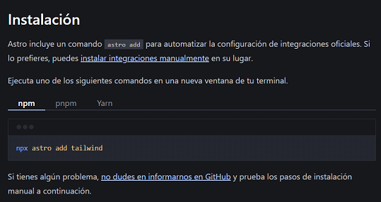
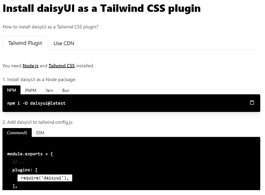
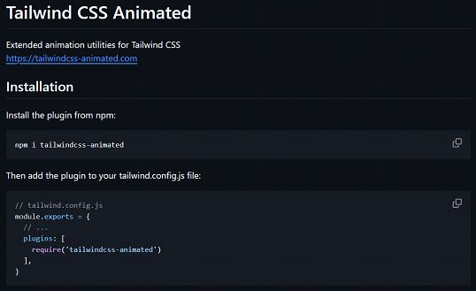

## Instalacion
https://docs.astro.build/es/guides/integrations-guide/tailwind/  

> npx astro add tailwind

## DaisyUI
https://daisyui.com/docs/install/  

> npm i -D daisyui@latest  
> require('daisyui'),

## Tailwind
https://github.com/new-data-services/tailwindcss-animated#readme  
https://www.tailwindcss-animated.com/  

> npm i tailwindcss-animated  
> require('tailwindcss-animated') 

## CookieConsent
https://github.com/orestbida/cookieconsent  
Ejemplo: https://stackblitz.com/edit/withastro-astro-mvdsyj  
> npm i vanilla-cookieconsent@3.0.1

revisar si existen versiones mas nuevas